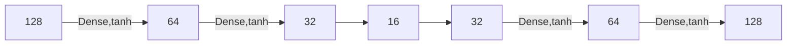
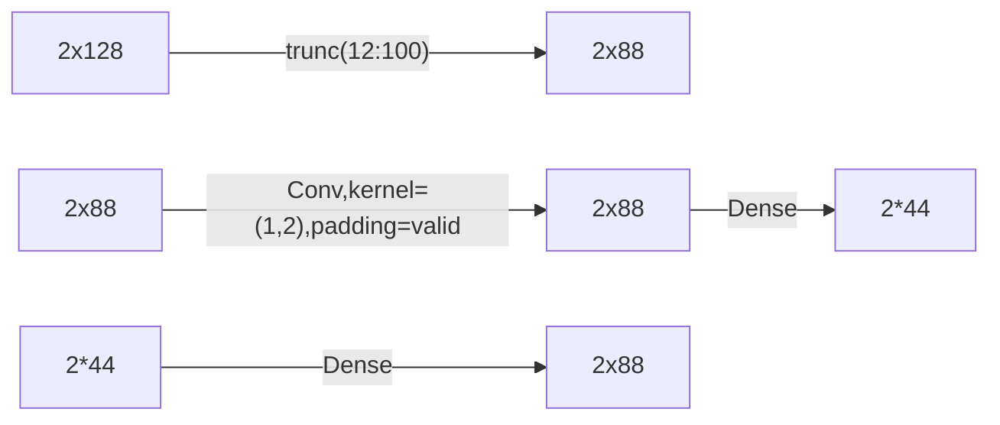

[toc]


# Unsupervised Representation Learning of ...

目的:通过复现论文中出现的各种自编码器方法和网络结构,增强对深度学习自编码器部分的掌握.

## 数据集

论文所用数据集`2016.04C.multisnr.pkl`为一字典，共有220个键，11中调制方式分列如下：

```python
('8PSK',0),('8PSK',10),('8PSK',-10),('8PSK',12),('8PSK',-12),('8PSK',14),('8PSK',-14),('8PSK',16),('8PSK',-16),('8PSK',18),('8PSK',-18),('8PSK',2),('8PSK',-2),('8PSK',-20),('8PSK',4),('8PSK',-4),('8PSK',6),('8PSK',-6),('8PSK',8),('8PSK',-8),

('AM-DSB',0),('AM-DSB',10),('AM-DSB',-10),('AM-DSB',12),('AM-DSB',-12),('AM-DSB',14),('AM-DSB',-14),('AM-SB',16),('AM-DSB',-16),('AM-DSB',18),('AM-DSB',-18),('AM-DSB',2),('AM-DSB',-2),('AM-DSB',-20),('AM-DSB',4),('AM-DSB',-4),('AM-DSB',6),('AM-DSB',-6),('AM-DSB',8),('AM-DSB',-8),

('AM-SSB',0),('AM-SSB',10),('AM-SSB',-10),('AM-SSB',12),('AM-SSB',-12),('AM-SSB',14),('AM-SSB',-14),('AM-SSB',16),('AM-SSB',-16),('AM-SSB',18),('AM-DSB',-18),('AM-SSB',2),('AM-SSB',-2),('AM-SSB',-20),('AM-SSB',4),('AM-SSB',-4),('AM-SSB',6),('AM-SSB',-6),('AM-DSB',8),('AM-SSB',-8),

('BPSK',0),('BPSK',10),('BPSK',-10),('BPSK',12),('BPSK',-12),('BPSK',14),('BPSK',-14),('BPSK',16),('BPSK',-16),('BPSK',18),('BPSK',-18),('BPSK',2),('BPSK',-2),('BPSK',-20),('BPSK',4),('BPSK',-4),('BPSK',6),('BPSK',-6),('BPSK',8),('BPSK',-8),

('CPFSK',0),('CPFSK',10),('CPFSK',-10),('CPFSK',12),('CPFSK',-12),('CPFSK',14),('CPFSK',-14),('CPFSK',16),('CPFSK',-16),('CPFSK',18),('CPFSK',-18),('CPFSK',2),('CPFSK',-2),('CPFSK',-20),('CPFSK',4),('CPFSK',-4),('CPFSK',6),('CPFSK',-6),('CPFSK',8),('CPFSK',-8),

('GFSK',0),('GFSK',10),('GFSK',-10),('GFSK',12),('GFSK',-12),('GFSK',14),('GFSK',-14),('GFSK',16),('GFSK',-16),('GFSK',18),('GFSK',-18),('GFSK',2),('GFSK',-2),('GFSK',-20),('GFSK',4),('GFSK',-4),('GFSK',6),('GFSK',-6),('GFSK',8),('GFSK',-8),

('PAM4',0),('PAM4',10),('PAM4',-10),('PAM4',12),('PAM4',-12),('PAM4',14),('PAM4',-14),('PAM4',16),('PAM4',-16),('PAM4',18),('PAM4',-18),('PAM4',2),('PAM4',-2),('PAM4',-20),('PAM4',4),('PAM4',-4),('PAM4',6),('PAM4',-6),('PAM4',8),('PAM4',-8),

('QAM16',0),('QAM16',10),('QAM16',-10),('QAM16',12),('QAM16',-12),('QAM16',14),('QAM16',-14),('QAM16',16),('QAM16',-16),('QAM16',18),('QAM16',-18),('QAM16',2),('QAM16',-2),('QAM16',-20),('QAM16',4),('QAM16',-4),('QAM16',6),('QAM16',-6),('QAM16',8),('QAM16',-8),

('QAM64',0),('QAM64',10),('QAM64',-10),('QAM64',12),('QAM64',-12),('QAM64',14),('QAM64',-14),('QAM64',16),('QAM64',-16),('QAM64',18),('QAM64',-18),('QAM64',2),('QAM64',-2),('QAM64',-20),('QAM64',4),('QAM64',-4),('QAM64',6),('QAM64',-6),('QAM64',8),('QAM64',-8),

('QPSK',0),('QPSK',10),('QPSK',-10),('QPSK',12),('QPSK',-12),('QPSK',14),('QPSK',-14),('QPSK',16),('QPSK',-16),('QPSK',18),('QPSK',-18),('QPSK',2),('QPSK',-2),('QPSK',-20),('QPSK',4),('QPSK',-4),('QPSK',6),('QPSK',-6),('QPSK',8),('QPSK',-8),

('WBFM',0),('WBFM',10),('WBFM',-10),('WBFM',-12),('WBFM',12),('WBFM',14),('WBFM',-14),('WBFM',16),('WBFM',-16),('WBFM',18),('WBFM',-18),('WBFM',2),('WBFM',-2),('WBFM',-20),('WBFM',4),('WBFM',-4),('WBFM',6),('WBFM',-6),('WBFM',8),'WBFM',-8),

```

每个键下的值`(N,2,128)`,表示N条实部虚部各128点的等间隔采样时序序列. N从600到1400不等.

## 实验环境

选用`tensorflow2.0-gpu`

## 全连接自编码器

### 网络结构

采用全连接网络对(QPSK,10)信号的实部进行表示学习,网络结构如下:



将128位一维数据编码为16位一维数据.

### 损失函数

`loss=MSE(x_,x_rec_)`

论文推荐MSE,也可用SNR和BER.

### 效果评估:Visual Inspection

每遍历训练完一次数据集,使(QPSK,2)的某信号经过训练好的网络,观察重构结果.


> epoch10


> epoch100


> epoch399

## 正则化

### L2正则化

改变上述自编码器的损失函数

`loss=MSE(x_,x_rec_)+0.001*l2_loss(all_trainable_variables)`

同时,将训练集改为(QPSK,8)

视觉评估


> epoch10


> epoch100


> epoch299

分析: 损失函数中增加了L2正则化后同等条件下需要的训练时间相对较长.和第一个实验相比较,可以比较明显地看出其在波峰位置不再出现尖锐的角度,说明泛化能力有了较好的提升.

### L1正则化

改变自编码器的损失函数

`loss=MSE(x_,x_rec_)+0.001*l1_loss(all_trainable_variables)`


> 理想效果图

实验中提取出中间编码层部分未见明显稀疏趋势,暂未明确"网络参数稀疏"和"中间层稀疏"的内在关联.

## 卷积自编码器

设计网络结构如下:



采用MSE和L2正则化作为损失函数.

实验结果:


> [(QPSK,-10),200]原始信号


> epoch100


> epoch400


> epoch1000


> masking

以上只是初步实验结果,卷积网络参数较多,各方面还在优化中.

## 去噪自编码器

由于没有"加噪和不加噪的同一段信号序列",也没掌握人工加噪的方法(显然只靠加性高斯噪声进行去噪训练并不能使模型具有泛化到真实信道干扰的能力),暂时没有有效的实验.

