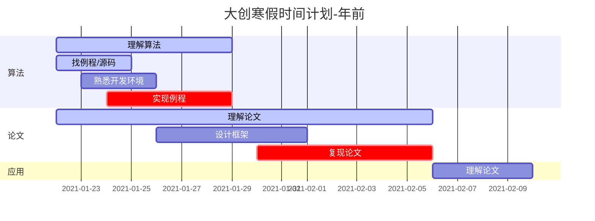
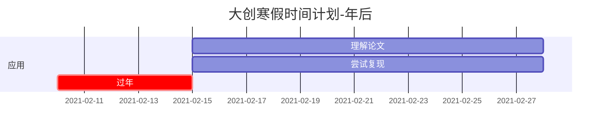
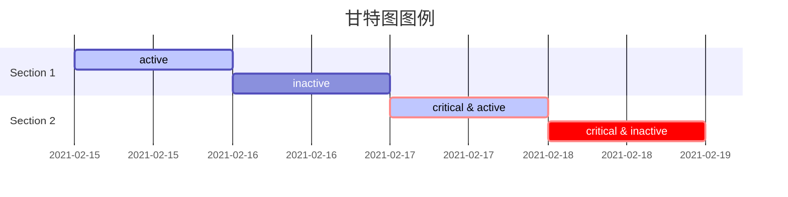

# 大创寒假时间安排	$21^{st},Jan$

## 说明:

### 寒假总体任务

1.熟悉掌握各种无监督学习算法并会编制程序;2.尝试复现通信系统中的应用相关论文.

### 算法分工

| 组员   | 分工         |
| ------ | ------------ |
| 姜以恒 | 生成对抗网络 |
| 刘润昕 | 迁移学习     |
| 郭子娴 | 对比预测编码 |

### 时间安排

将寒假任务分为3个部分:

算法:即搞明白自己的算法到底是怎么运作的,主要学习方式为寻找源码,编程实验.能把老师给的论文的源码找到最好,找不到的话就找该算法的其他例程.

论文:对算法有大致理解以后再尝试彻底搞懂读老师给的论文,主要学习方式为复现论文中的实验(我的那篇实验比较多,我决定随便挑一个复现).

应用:老师最新发的三篇论文,不是主要矛盾,年后有时间看一看.

### 时间节点说明

1.我在年前设置了两个DDl,即红色任务截止时间(1.29和2.6),届时需要各位在电脑上跑通相应的程序. 当然,如果你在找例程的时候直接找到了论文实验的源码,我想你就不用做第一个DDL, 直接2.6之前复现论文就可以了.

2.大家可以再等个三四天开工. 但是在开工以后,我每天晚上都需要各位在群里汇报一下进度以克服惰性.

3.甘特图图例

